# Hubs for Free


Run the standard head-interaction pipeline on random matrices and it finds
a coordinator head, a spectral gap, and a symbolic law. Run it on a trained
language model and it finds the same things, for a different reason: the
attention heads of a layer are, to first order, one shared operator, and
that operator is the attention sink. This repository follows that thread
from a null result to a one-parameter law that holds from 0.1B to 7B
parameters across six architecture families and along the training of two
models, and turns the instruments built along the way into a toolkit that
anyone analyzing attention can run.

## How the findings connect

**Random matrices already contain the signatures.** On causal softmax
matrices with no training behind them, the pipeline that looks for
structure among heads finds it every time: a dominant hub, a large
eigengap, a one-versus-(n-1) spectrum, and a "special" head flagged by the
2-sigma rule in 62 percent of draws at 14 heads and 96 percent at 32. A
formula search on structure constants extracted from noise reaches the
same fit quality as the archived real-model search. Two four-line proofs
explain why: row-stochasticity forces one shared invariant direction on
every attention layer, and for causal attention the generator norm obeys
2||G||_F^2 = sum_i (IPR_i - A_ii^2) exactly, so it measures sharp non-self
attention and nothing else. The whole battery regenerates in under a
minute on a laptop.

<p align="center">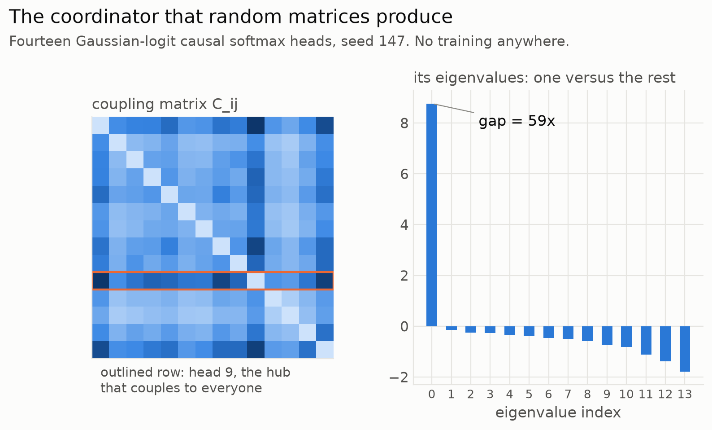</p>

<p align="center"><em>Fourteen random heads, no training: a hub that couples to everyone and a 59-fold spectral gap.</em></p>

<p align="center">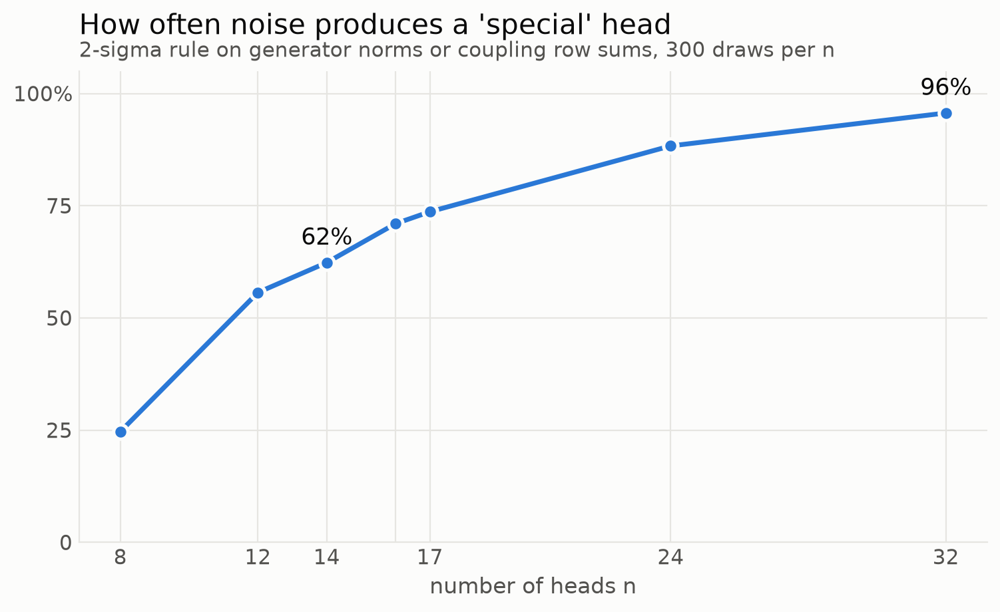</p>

<p align="center"><em>The 2-sigma rule finds a special head in noise most of the time, and almost always past 24 heads.</em></p>

**Trained models depart from the random picture, in one specific way.**
On noise, the pairwise coupling matrix of a layer's heads is almost
exactly rank one in the head norms (correlation 0.98 with the norm-product
matrix). On a trained model it is not: at the deepest sink layers the
correlation falls to -0.5 and below. Surrogates that keep every head's
per-row sharpness and self-mass but scramble the rest restore the random
picture perfectly, so the departure is real inter-head structure, and the
question became what it is.

<p align="center">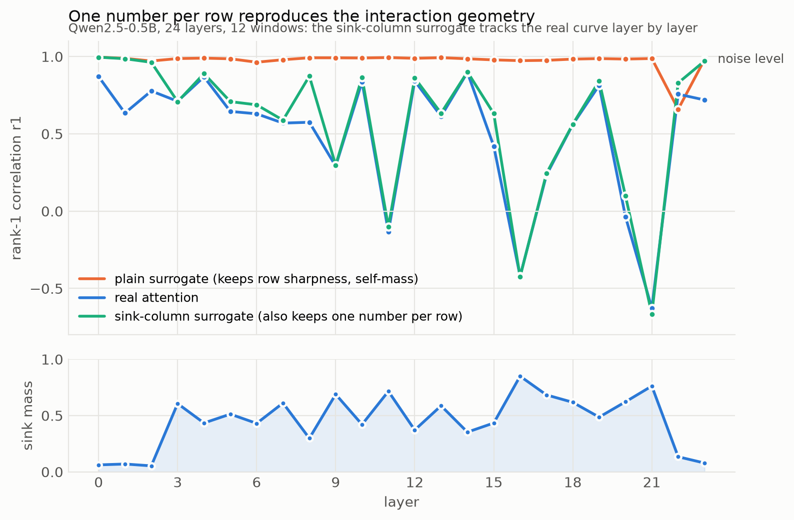</p>

<p align="center"><em>Marginal-matched surrogates stay at the noise level; the sink-column surrogate follows the real curve layer by layer.</em></p>

**It is one shared operator, and the operator is the sink.** Stack the
skew-symmetric parts of a layer's heads and take their top principal
component. Across 230 high-sink layers of eleven models (Qwen2.5 0.5B to
7B in base and Instruct form, GPT-2 medium, Pythia-410m, TinyLlama-1.1B,
Mistral-7B, Phi-3-mini, OLMo-2-7B) that component is the ideal sink
operator at every one of them, with cosine 0.71 to 1.00 and above 0.87 at
91 percent of layers. It carries 0.51 to 0.99 of each head's energy. It
spans grouped-query KV groups, so the architecture does not create it, and
instruction tuning leaves it untouched. A later rerun of all thirteen
models under one protocol, with 48 windows per model and the instruments
fixed, reproduces this at every high-sink layer of every model.

<p align="center">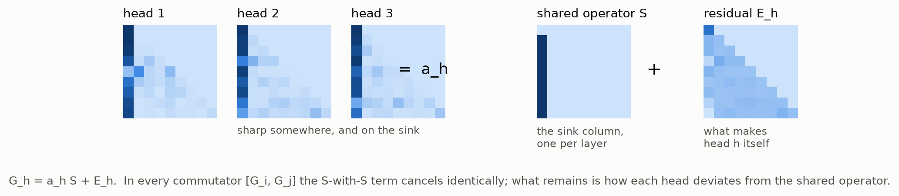</p>

<p align="center"><em>Every head is a multiple of the same operator plus a residual of its own.</em></p>

<p align="center">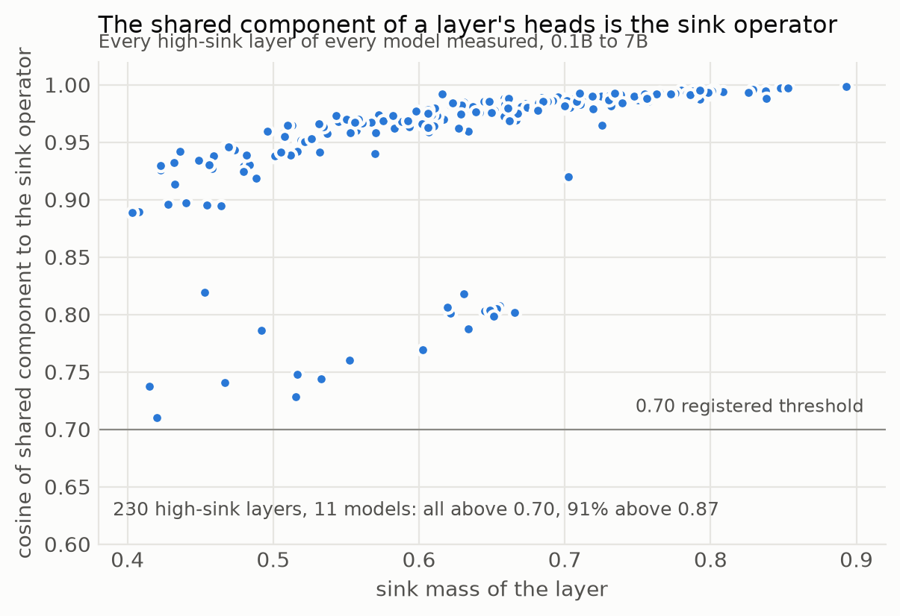</p>

<p align="center"><em>230 high-sink layers across eleven models: the shared component is the sink operator in every one.</em></p>

<p align="center">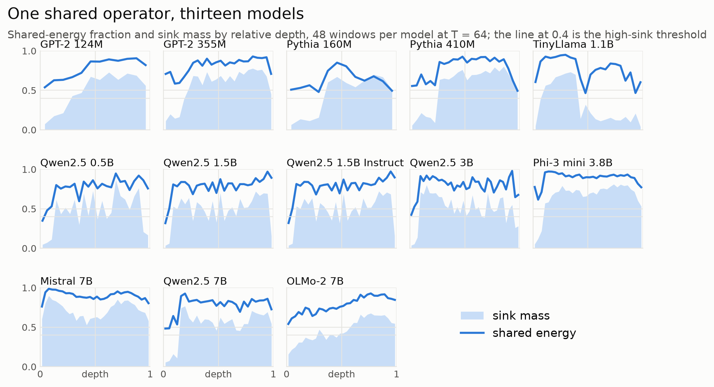</p>

<p align="center"><em>Thirteen models, one shape: the shared-energy fraction rises with the sink mass and stays high wherever the sink does.</em></p>

**The shared operator cancels out of every interaction statistic.**
Writing each head as G_h = a_h S + E_h, the shared-times-shared term
vanishes identically in every commutator,
[G_i, G_j] = a_i [S, E_j] - a_j [S, E_i] + [E_i, E_j],
and on real models the cross terms outweigh the deviation term by 4x to
25x at every head pair tested. This is why interaction statistics on
trained attention behave as they do: a surrogate that preserves each
row's sharpness, self-mass, and one number per row, the sink-column
entry, reproduces the real coupling statistics layer by layer, to three
decimals at the deepest layers of Mistral-7B. At this resolution the
statistics contain nothing else. A preregistered generative test makes
the point directly: rebuilding each head from its real sink column alone,
with random entries everywhere else, reproduces the per-layer coupling
statistics of eleven of twelve models (Spearman 0.85 to 0.99 with the real
z profile, pooled 0.95 over 310 layers, against 0.13 when the sink column
is replaced by a shared average). A layer's heads are their sink-column
profiles plus noise; the one exception, TinyLlama's late layers, has no
sink to be a profile of. Where the sink wanders between columns
from one input to the next (OLMo-2), a set of at most three columns does
the same job: the model that failed the one-column test at 19 percent of
layers passes the column-set test at 79.

<p align="center">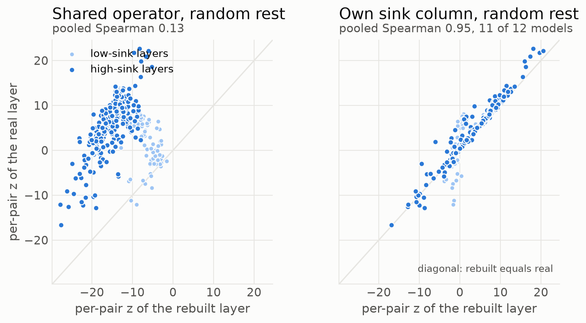</p>

<p align="center"><em>Twelve models, 310 layers: rebuild the heads from a shared operator and the coupling statistic is lost; rebuild each from its own sink column and it is recovered.</em></p>

<p align="center">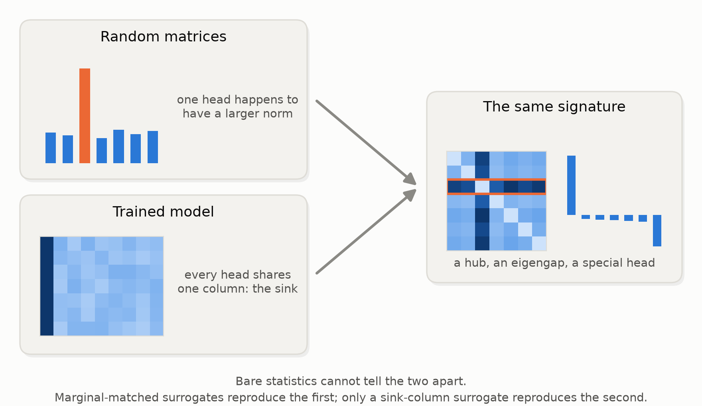</p>

<p align="center"><em>The same signature from two mechanisms; only constrained surrogates tell them apart.</em></p>

**Alignment does it, not concentration.** Heads that are each sharply
concentrated but on different columns show the opposite signature in
synthetic ensembles and in redesigned controls on five held-out models:
the shared mode collapses, the rank-one geometry returns, and commutators
grow rather than shrink. What the heads share is a column, not a habit of
sharpness. The first control lost its power at 32 heads, and a toy sweep
found the reason: in 64-token windows half of the rows cannot host 32
distinct target columns, so no permutation can misalign such a layer. At
256 tokens, with a control that treats every row alike, the dissociation
holds at every high-sink layer of every one of eleven models. In
Mistral-7B the shared mode falls to a tenth and the median per-pair z
rises from 78 to 271 across all 32 layers.

<p align="center">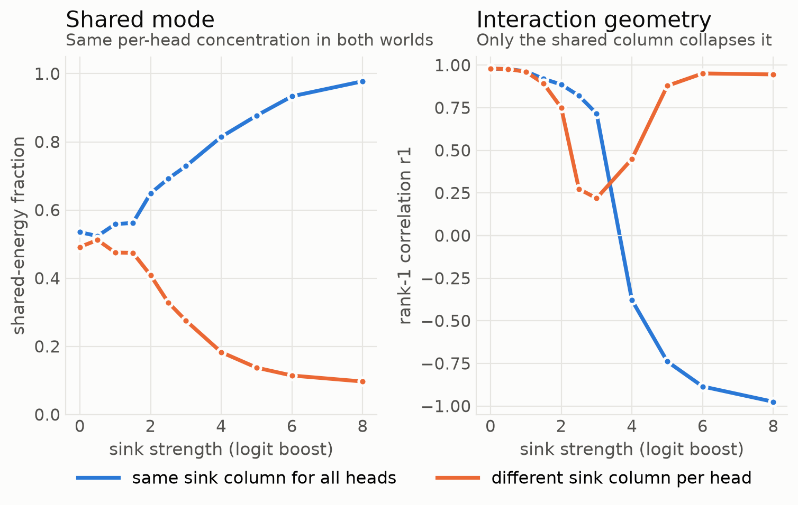</p>

<p align="center"><em>Same per-head concentration, opposite outcomes: only the shared column builds the shared mode and collapses the geometry.</em></p>

<p align="center">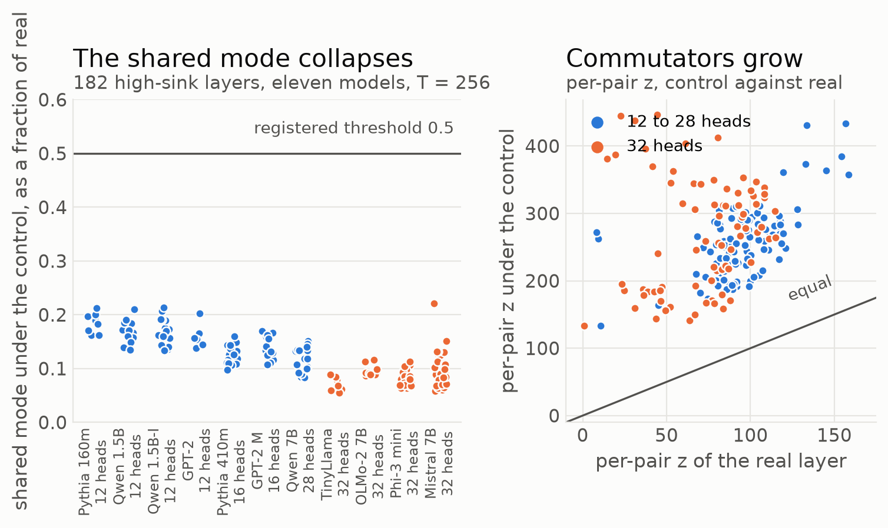</p>

<p align="center"><em>The fixed control on 182 high-sink layers of eleven models at 256 tokens: the shared mode collapses below half everywhere, and commutators grow at every layer, 32-head models included.</em></p>

**One number per layer predicts the geometry, and the prediction
transfers.** The layer's shared-energy fraction predicts its coupling
statistic at Spearman -0.76 across the high-sink layers of five held-out
models at or below 1.5B, and again at -0.76 in a separately preregistered
3B-to-7B round of 130 layers, and at -0.70 (interval -0.76 to -0.62)
over 182 layers when all thirteen models were rerun under one protocol
with the ill-conditioned layers excluded. A fully synthetic toy ensemble,
built from nothing but noise plus one shared column, places the regime
flip between shared energy 0.85 and 0.93, exactly where the real layers
flip. Three numbers per head reproduce the development model's depth
profile at Spearman 0.81.

<p align="center">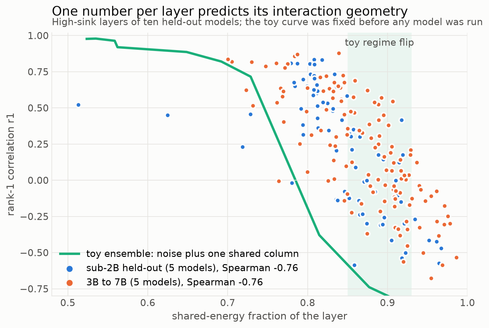</p>

<p align="center"><em>Ten held-out models across two preregistered rounds fall along the curve a noise-plus-one-column toy predicted in advance.</em></p>

**Training replaces one shared operator with another.** An untrained
network already has a dominant shared component: with near-uniform
attention every head carries the same operator, the uniform causal
operator (cosine 1.00 to it in every layer), at 0.9 of its energy, and
that component is not the sink (cosine 0.27). Ten public
checkpoints each of Pythia-160m and Pythia-410m, with every prediction
frozen and pushed before the first download, show what training does with
it. The initial component is broken up first, and by step 1000 the layers
sit in the random-matrix regime with no sink anywhere. Then the sink forms
abruptly, between steps 1000 and 2000 in the 410m and between 4000 and
8000 in the 160m, and in the same checkpoint the shared component becomes
the sink operator, cosine above 0.9, in 25 of the 26 layers that end
high-sink. From there alignment deepens and the layers ride down the same
curve as the converged models (Spearman -0.74 across 152 checkpoint-layer
cells), changing sign at shared energy 0.77 to 0.87, where the toy put
the crossing. One registered secondary prediction failed: the 160m forms
its sink later than step 4000.

<p align="center">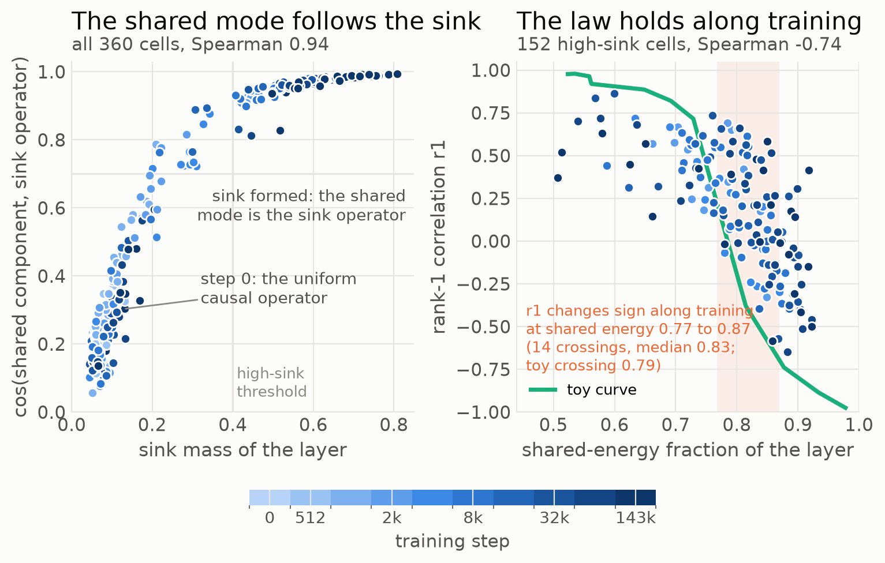</p>

<p align="center"><em>Left: the shared component locks onto the sink operator as the sink appears, 360 checkpoint-layer cells colored by training step. Right: the alignment law along training, on the toy curve fixed before the run.</em></p>

## What you can use today

Each instrument below exists because a finding above required it.

<p align="center">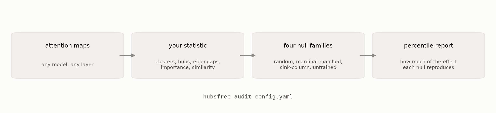</p>

<p align="center"><em>The toolkit in one line.</em></p>

<p align="center">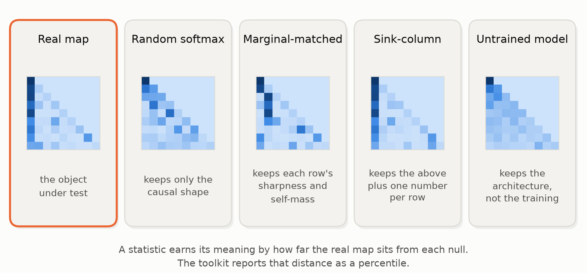</p>

<p align="center"><em>What each null keeps; the real map's distance from each is the report.</em></p>

- **The `hubsfree` toolkit.** Because the standard signatures appear on
  noise, every statistic computed on attention maps (clusters, hubs,
  eigengaps, special heads, similarity or interaction matrices, importance
  scores) now has a null to be measured against. The toolkit runs the
  families in one command: random causal or bidirectional softmax matched
  in heads and length, per-row marginal-matched surrogates, surrogates
  preserving the sink column set, and two dissociation controls that keep
  every head as concentrated as it was while removing the shared column.
  The report gives the real statistic's percentile in each null and the
  fraction of the effect each null already reproduces. `hubsfree extract`
  saves a layer's maps from any Hugging Face model, `hubsfree audit` runs
  the battery on them, `hubsfree demo` shows the random-matrix coordinator
  in under a second; the guide is `docs/toolkit.md`.
- **Sink-aware head comparison.** Because one column carries most of the
  inter-head signal, any pipeline that ranks, clusters, merges, or prunes
  heads from attention maps (attention-based importance, attention
  rollout, similarity-based head merging) can now report its result
  against a sink-preserving null. Without it, the pipeline is largely
  measuring how much each head attends to the sink token.
- **Base rates before calling a component special.** Because the 2-sigma
  rule flags a special head, neuron, or dimension on pure noise 62 percent
  of the time at 14 candidates and 96 percent at 32, the repository
  tabulates the false-flag rate of k-sigma rules as a function of n. The
  same table applies to any outlier hunt among n components, well beyond
  attention.
- **Matched-noise floors for formula discovery.** Because symbolic
  regression reaches nontrivial fit quality on noise, the battery reports
  the best fit the identical search achieves on shape-matched noise, the
  line a real fit has to clear. Built for "AI scientist" pipelines that
  fit laws to model internals.
- **A working protocol for AI-assisted analysis.** Every number in this
  repository was produced under one discipline: the artifact is written
  before the number is cited, nulls run before interpretation, thresholds
  are frozen and pushed before the runs, evaluation code is committed
  before results exist, and registered predictions that fail are reported
  as failures. The protocol is documented end to end in the commit history
  and is ready to adopt.
- **A reviewer's checklist** (paper.md, Section 6) for structure findings
  about attention, usable as is in peer review or internal model reports.

## Where the work goes next

- **A redundancy diagnostic for inference: tested, and it is not one.**
  The shared-energy fraction is one number per layer that says how much of
  the heads' operator content is one shared component. A preregistered
  test asked whether it predicts which layers tolerate head merging, and
  whether the generator cosine picks the pair to merge, on Qwen2.5-1.5B, 3B
  and 7B. Both predictions failed as registered: merging any pair of heads
  within a KV group costs a median 0.0007 to 0.0013 nats per token at
  almost every layer, and neither the cosine nor the shared energy says
  which pair or which layer. The fraction is a measurement of attention
  geometry, not a tolerance tool, and the repository says so.
<p align="center">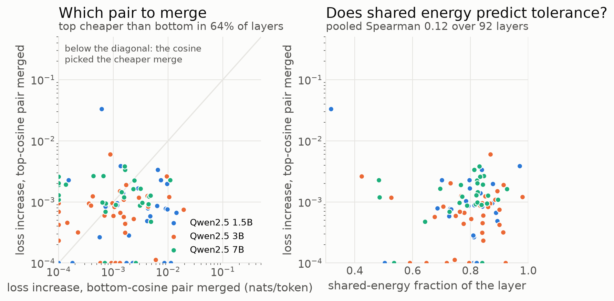</p>

<p align="center"><em>The failed practical test: merges are cheap almost everywhere, and neither the pair cosine nor the shared energy predicts the cost.</em></p>

- **Turning the nulls on published findings.** The audit program
  (`audits/TARGETS.md`) asks whether well-known findings about attention
  heads survive the same nulls: the layer clustering of BERT's heads
  (Clark et al. 2019), the attention-pattern taxonomy (Kovaleva et al.
  2019), cross-head redundancy as used for KV compression (CHAI, 2024),
  spectral outliers in projection weights (2026), and retrieval heads as
  the positive control the nulls must not remove. Four base results are
  reproduced or partially reproduced and their criteria frozen in
  `audits/PREREGISTRATION4_DRAFT.md` (the layer clustering; the spectral
  outliers, whose counts match the source to 0.3 percent; the retrieval
  heads, 4.2 percent of heads against the source's 3 to 6; the redundancy
  clusters in part, with the source's depth trend not reproduced); the
  attention-pattern taxonomy could not be reproduced because its classifier
  and annotations were never released. The batteries run after public
  registration of the draft; results follow with the original authors'
  responses.
- **Deriving the operator rather than measuring it: a floor, not a
  formula.** A preregistered derivation writes each head's energy along
  the ideal sink direction from its own sink mass and row sharpness, with
  no cross-head information, and predicts the layer's shared energy from
  the mean. Across 310 layers of twelve models it orders the layers at
  Spearman 0.86 and sits below the measured value at every high-sink
  layer, within 0.06 at the median, but it explains 55 percent of the
  variance across models rather than the registered 80. The shared energy
  is measured structure with a derived lower bound.

<p align="center">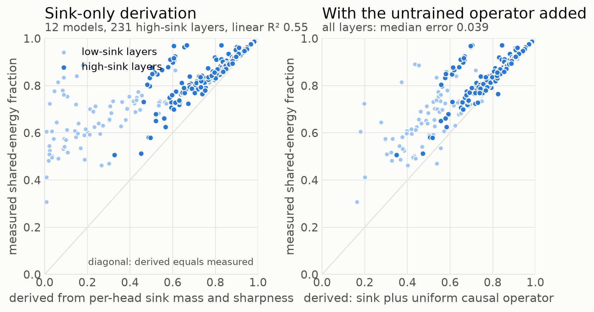</p>

<p align="center"><em>The derived floor tracks the measured shared energy but does not reach it; adding the untrained network's operator closes part of the gap at low-sink layers.</em></p>

## Evidence standard

Eight preregistrations with numeric thresholds and falsification clauses
were frozen in git before their runs (`alignment_study/PREREGISTRATION.md`
and `PREREGISTRATION2.md` to `PREREGISTRATION9.md`; the second committed
before the held-out models were downloaded, the third and all later ones
pushed publicly before execution, evaluation scripts committed before
results existed). Registered predictions that failed are
reported as failures, not reinterpreted: the universal-breakdown
prediction (A1), the first dissociation control (A7, design flaw
documented and replaced), the sharp regime-edge threshold (H4b),
one-column sufficiency on TinyLlama (H2) and OLMo-2 (S2), the
dissociation control at 32 heads (S3), early sink formation on
Pythia-160m (D4), both merge-tolerance predictions (M1, M2), and the
derivation gate (G1). Out of sample, 7 of 8 registered clauses passed in the
sub-2B round, 3 of 4 in the 3B-to-7B round, 5 of 5 primary clauses in the
training-dynamics round, 4 of 4 in 11 of 11 models in the
fixed-instrument rerun, where the earlier failures on TinyLlama, OLMo-2
and the 32-head models resolved without moving a threshold, 0 of 2
primary clauses in the head-merging round, whose negative result is
reported in full above, and 4 of 4 in the sink-profile round. Development
calibration that shaped a preregistration is committed and labeled as
such. A blind reimplementation from the written specification
reproduced the anchor values to four decimals; surrogate invariants hold
to 1e-15; per-layer bootstrap confidence intervals are reported;
adversarial review objections (statistic ill-conditioning, GQA confound,
circularity risks) were tested and are answered in
`alignment_study/NOTE.md`. The synthetic battery regenerates from
`experiments.py` and CI checks it on every push. Every number in every
document regenerates from a committed script into a committed artifact,
with one exception stated in `CLAUDE.md`: the small-model pilot in
paper.md Section 7, whose scripts are author-held pending upload.

## Where this sits in the literature

Attention sinks and their prevalence across heads are documented at the
distribution level (Xiao et al. 2023; Sun et al. 2024; Gu et al. 2025;
Barbero et al. 2025), as is similarity between heads' attention
distributions (Clark et al. 2019; Bian et al. 2021), and constrained
surrogate testing has a long lineage outside interpretability (Theiler
1992; Elsayed and Cunningham 2017; Adebayo et al. 2018). New here, checked
against the literature with adversarial search before being stated: the
operator-level decomposition of a layer's heads and the identification of
its shared component with the sink; the commutator cancellation and its
measured dominance structure; per-row marginal-matched and
column-preserving surrogates for attention statistics; the out-of-sample
alignment-fraction law; and the toolkit that packages the nulls.

## Repository map

- `paper.md` - the methods paper: what commutator-based analyses of
  attention measure, with the full null battery and a case study.
- `manuscript.md` - the flagship draft that assembles every round, with a
  preregistration ledger and a numbers ledger mapping each reported number
  to its artifact; sections waiting on running rounds are marked.
- `replicate.ipynb` - one-click replication on Colab or Kaggle: toolkit
  demo, tests, synthetic battery regeneration, the anchor check, one
  dynamics cell.
- `experiments.py`, `results.json`, `figures/` - the synthetic battery
  behind paper.md Sections 3 to 4.6; `check_results.py` and
  `.github/workflows/regenerate.yml` verify it regenerates.
- `make_readme_figures.py` - renders every chart and illustration on this
  page from the committed result files.
- `alignment_study/` - the shared-operator studies: five
  preregistrations, all scripts and result JSONs (per-checkpoint dynamics
  results in `dynamics/`, per-model rerun results in `rerun/`), the run
  log, and the study note with scorecards (`NOTE.md`).
- `hubsfree/`, `tests/`, `pyproject.toml`, `docs/toolkit.md`, `examples/` -
  the toolkit (v0.1.0.dev0): statistics, null families including the
  dissociation controls, battery report, CLI, guide and two runnable
  examples.
- `audits/` - audit targets, the preregistration-4 draft, per-target
  reproductions (`clark2019/`).
- `run_qwen_protocol.py`, `qwen_results.json` - the six-prediction
  protocol on Qwen2.5-0.5B.

## Reproduce

```
./setup.sh                                  # pinned environment (requirements.txt)
source .venv/bin/activate
python experiments.py                       # synthetic battery, under a minute on CPU
pip install -e . && hubsfree demo           # the random-matrix coordinator, one second
python -m pytest tests                      # surrogate invariants and anchors
python make_readme_figures.py               # the figures on this page, from the JSONs
python alignment_study/tier1_robust.py      # development-model study
python alignment_study/heldout_round.py     # five held-out models
python alignment_study/dynamics_round.py    # Pythia checkpoints, about 22 GB of downloads
python alignment_study/eval_dynamics.py     # dynamics scorecard D0 to D5
python alignment_study/rerun_round.py       # thirteen models, fixed instruments, about 3 hours plus downloads
python alignment_study/eval_rerun.py        # rerun scorecard S1' to S4
```

Models and datasets download from Hugging Face on first use. The 3B-to-7B
round ran on a Colab T4 from `scale_colab.ipynb`; its captured outputs and
run history are in `alignment_study/scale_partial/` and
`alignment_study/RUNLOG.md`. The dynamics round ran on an Apple M1 Max
through MPS; the device and precision policy and its measured fidelity
against the CPU protocol are in `hubsfree/adapters.py` and the run log.

## Scope and open items

Results cover thirteen models up to 7B parameters, English text and code,
contexts up to 256 tokens, and training dynamics for two models of one
family. Where the sink sits on a mid-sequence,
window-varying column (OLMo-2, late Qwen2.5-3B layers) the sink-operator
identification weakens and one-column surrogates lose their grip, which
a set of up to three columns repairs in most layers but not all. In
64-token windows no permutation control can misalign 32 heads, so the
dissociation test needs 256-token windows. The
residual deviation directions carry structure the three-number summary
does not capture, and one low-dispersion layer is ill-conditioned for the
correlation statistic (diagnosed and flagged). Larger models, other
languages, and long contexts are untested.
